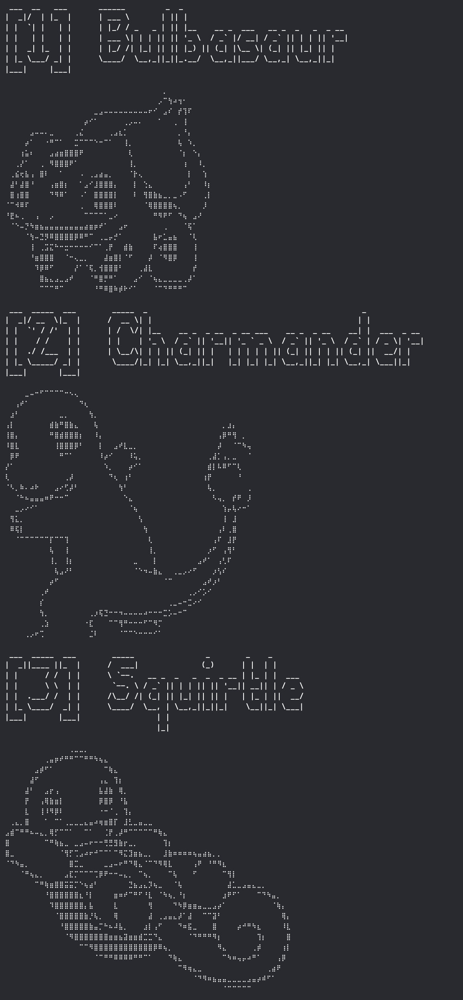
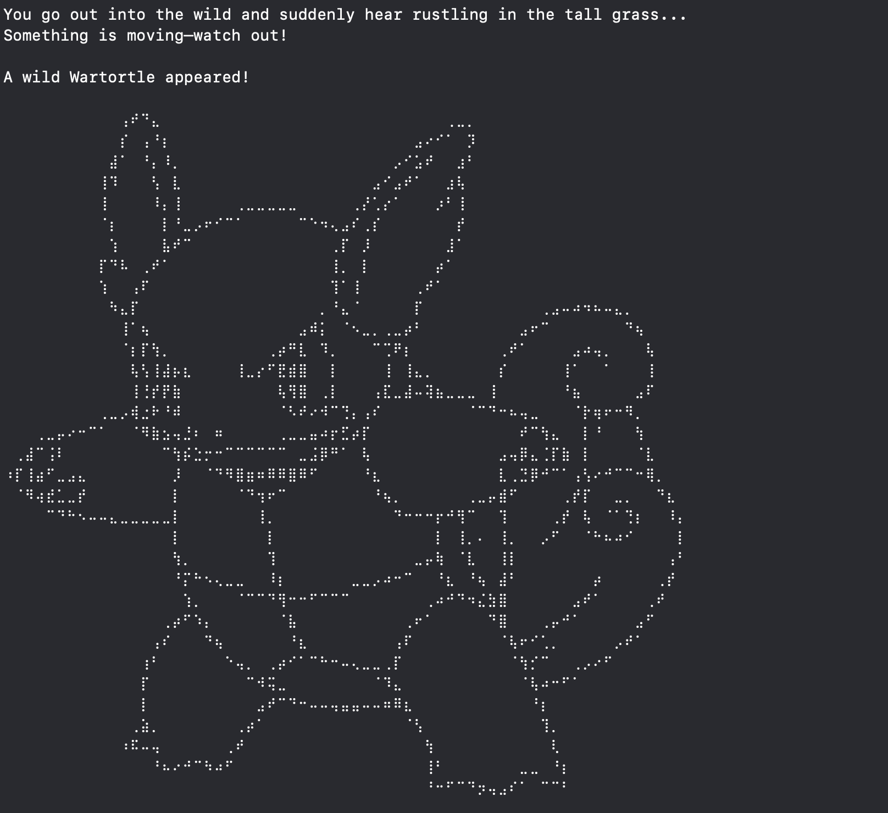
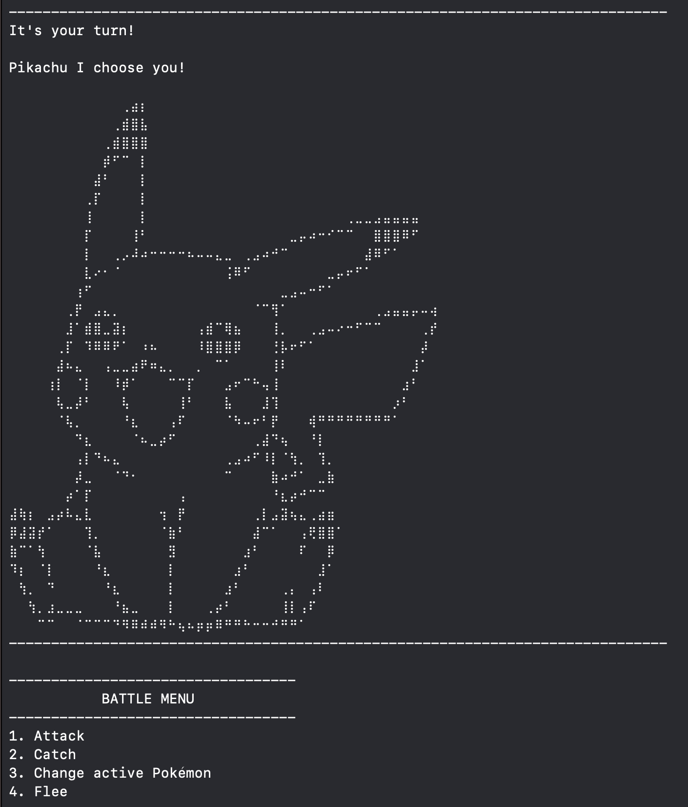
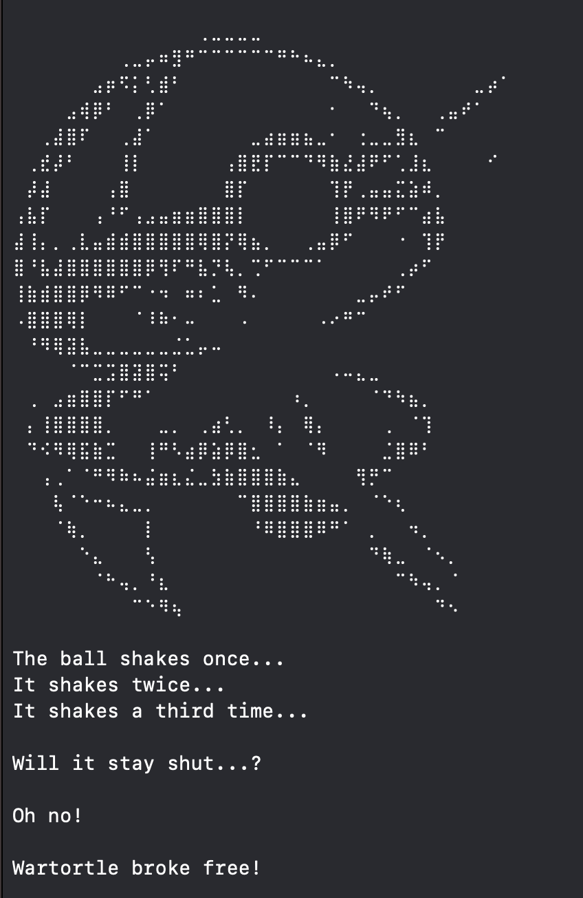
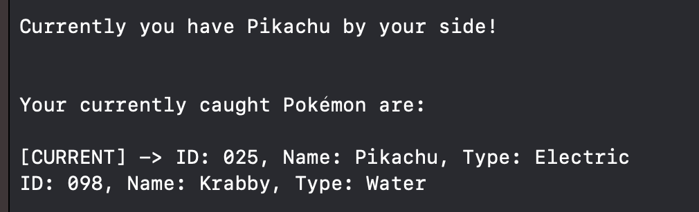
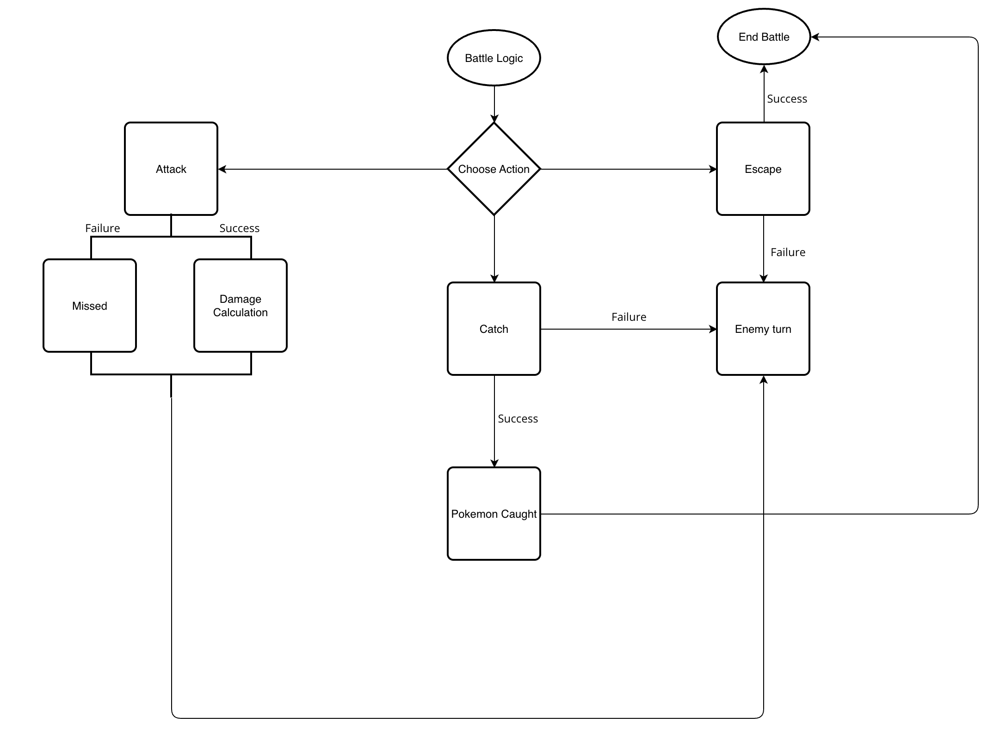
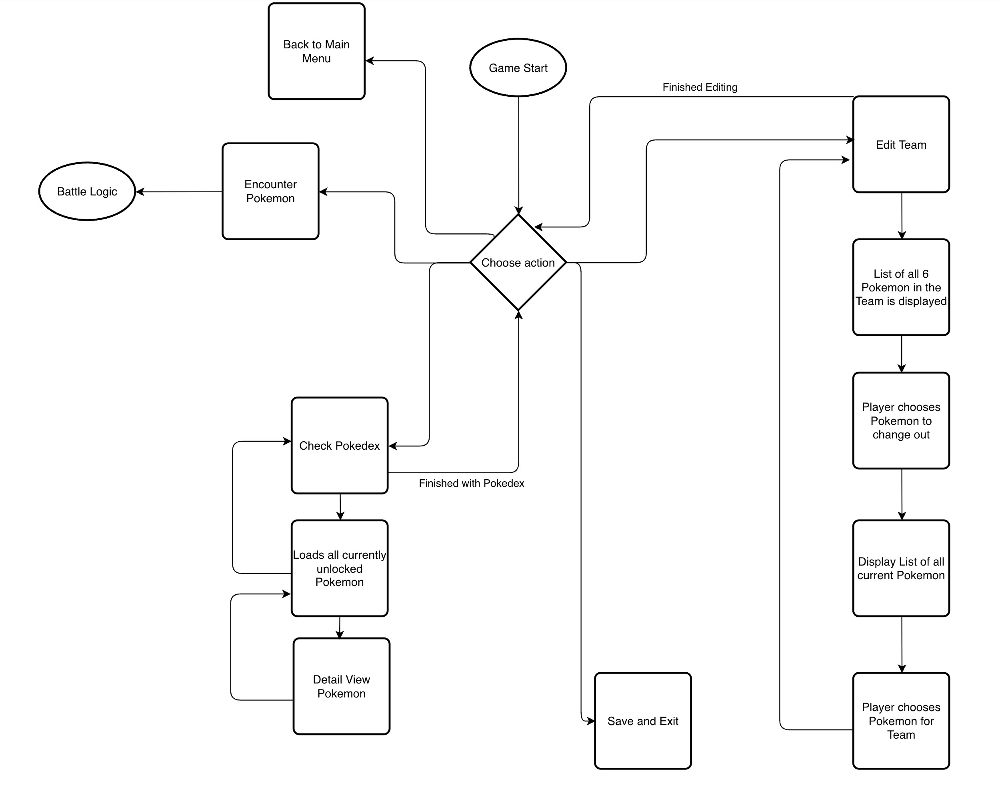
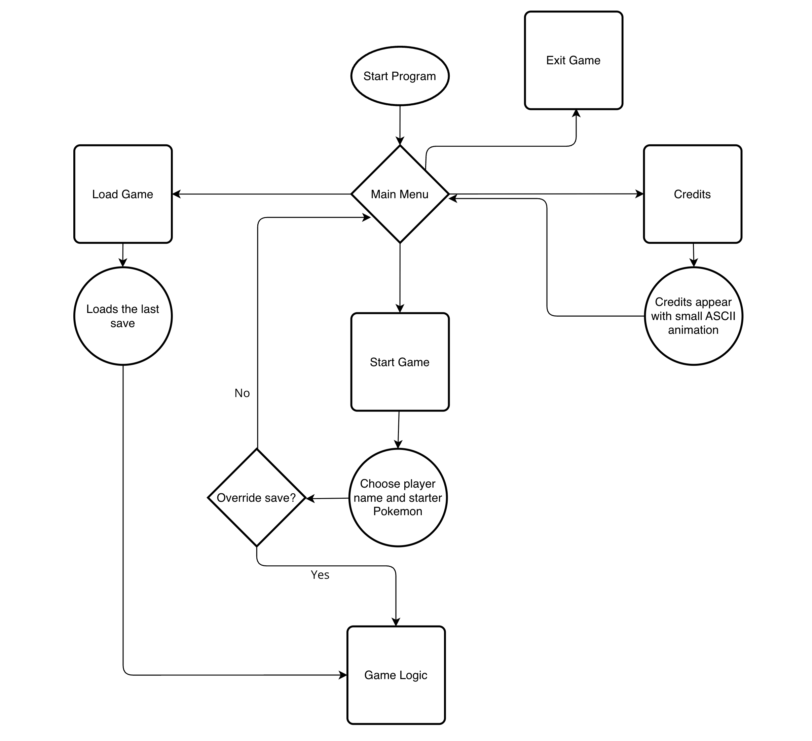

# Pokémon Terminal Game (Swift)


A minimal, text-based Pokémon game for the terminal – developed as a showcase project with a focus on test-driven development, modular architecture, and clean Swift code.

---

## Project Idea

This project is part of my Swift portfolio and demonstrates how to build a complete, logically structured game system using only terminal interaction in Swift. The goals were:

- Structuring game flow and systems modularly
- Applying Swift architectural principles (protocols, extensions, TDD, SRP)
- Creating a fun and simple example with real-world code structure

The code aims to show how even a text-based game can be broken down into small, testable, and maintainable modules.

---

## Game Overview

In Pokémon Terminal Game, players embark on a classic journey to catch all 151 Generation One Pokémon — entirely within a text-based terminal interface. The game recreates the core essence of traditional Pokémon games while focusing on code modularity and simplicity.

### How it works

1. Choose Your Starter: Begin your journey by picking one of four iconic starters: Bulbasaur, Charmander, Squirtle, or Pikachu. Each comes with unique stats and ASCII art. 

2. Explore via Encounters
Wild Pokémon appear randomly as you venture into tall grass. These encounters are driven by a randomness engine with checks for previously caught Pokémon, ensuring a full Pokédex challenge. 

3. Turn-Based Battle System
Engage in simple turn-based combat using a single attack move. Deal damage, track HP, and knock out wild Pokémon—or get knocked out yourself. 

4. Catch 'em All
Use Poké Balls to try and catch wild Pokémon. Each creature has a predefined catch difficulty, and success depends on chance—adding tension and replayability. 

5. Switch Your Pokémon
Swap your current active Pokémon with any you've previously caught to adjust your battle strategy. 

6. Try to Flee
Not every encounter is worth the risk. Fleeing is possible, but not guaranteed.

7. Save & Continue Later
The game supports a persistent save system, allowing players to resume progress with their current team and Pokédex across sessions.

8. Complete the Pokédex
Once all 151 Pokémon are caught, the game transitions to a Game Over state, showcasing your collection and congratulating your efforts.

---

## Getting Started 

### Requirements

- Swift 5.9 or higher

- Git installed

- macOS 

- Terminal access 

### Installation

1. Clone the Repository <pre> ```git clone https://github.com/YourUsername/pokemon_terminal_game.git``` </pre>
<pre> ```cd pokemon_terminal_game ``` </pre>

2. Build the Project <pre> ```swift build -c release``` </pre>

3. Run the Game <pre> ```swift run``` </pre>

That’s it! You’re now inside the Pokémon Terminal Game.

---

## Project Showcase:

- **Modular software architecture** using a layered structure (`Core`, `Services`, `States`, etc.)
- **State pattern** to manage game flow, enabling clean transitions between menus, battles, encounters, and more
- **Factory pattern** (`PokeFactory`) for flexible Pokémon instantiation from raw data arrays
- **Parser abstraction** (`PokeParser`) to separate data interpretation from logic
- **SOLID principles** applied throughout:
  - **S**: Single Responsibility – each class has exactly one task
  - **O**: Open/Closed – behavior is extensible via protocols and service abstraction
  - **L**: Liskov Substitution – protocol-oriented design allows safe interchange of types
  - **I**: Interface Segregation – small, purposeful protocols (e.g. `Battle`, `GameState`)
  - **D**: Dependency Inversion – services are injected rather than hard-coded

Further highlights:

- ASCII art rendering for all 151 Gen I Pokémon using a centralized reflection-based system
- Cross-platform file saving (macOS/Linux) without external dependencies
- Full test coverage with Arrange–Act–Assert (AAA) style unit tests
- Clear code documentation via `///` doc comments for public interfaces

---

## Project Flow (Screenshots)

A little look behind the scenes never hurts. Even though I didn't fully stick with this chart and made some adjustments here and there this is the flowchart I created during the planning phase of this project.

### 1. Main Menu & Game Start


### 2. Ingame Menu & Actions


### 3. Encounter & Battle Logic


---

## Possible future Features & Improvements

- Gameplay Enhancements
  - Leveling System: Pokémon gain experience from battles and level up, increasing their stats and evolving over time.
  - Team Management: Support for building a party of up to 6 Pokémon, including switching during battles.
  - Item Usage: Implement healing items, Poké Balls, and other usable items both in and outside of battle.
  - Battle Mechanics Overhaul: Add type effectiveness (e.g. Water > Fire), status effects (e.g. Sleep, Paralysis), and multi-move support.
  - Special Abilities or Attacks: Enable multiple moves per Pokémon with individual damage and accuracy values.
  - NPC Battles and Arena Challenges: Introduce trainers or gyms with increasing difficulty and progression goals.

- Technical Improvements
  - Backend Integration via API: Move all raw data (Pokémon, stats, ASCII art) to a remote JSON or database source and fetch it dynamically.
  - Multiple Save Slots: Add support for saving and loading from different user-defined save files.
  - Cross-Platform Support: Ensure compatibility with macOS, Linux, and Windows — including CLI builds and shell-based installation.
  - Plugin or Mod Support: Let players inject their own Pokémon or ASCII art via config files or modding folders.
  - Optional GUI (e.g. SwiftUI): Develop a visual frontend that runs on the same logic, enabling a graphical version of the game.
  - Test Automation and CI/CD: Add unit and integration tests using Swift’s built-in testing framework with GitHub Actions for automatic builds.

- UI/UX Polish
  - ASCII Animations: Add motion effects when throwing Poké Balls or entering new areas for more immersive terminal visuals.
  - Completion Stats & Progression Tracker: Display how much of the Pokédex is completed or how many battles have been won.
  - Localization Support: Provide multilingual support for menus and messages using localization files.

---

## Technologies Used

- Swift 5+
- XCTest
- Xcode
- Trello for project management
- Markdown documentation & Flowchart design

---

## © Legal Disclaimer

This project is **not affiliated with Nintendo, Game Freak, or The Pokémon Company** in any way. 
This project is a non-commercial fan-made portfolio piece. 
I do not own the rights to Pokémon. 
All rights to the Pokémon franchise, including characters, names, and assets, are the property of The Pokémon Company, Nintendo, Game Freak, and Creatures Inc.
This project is intended for **educational and demonstration purposes only**, as part of a private programming portfolio. It is not distributed or promoted commercially.